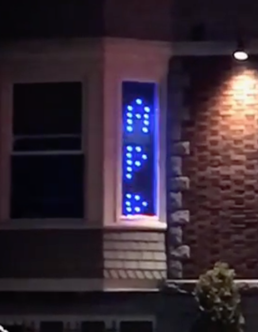

# Window lights

Code for a window that displays messages that are texted to it. 

Low-res pic — see a video on [my Instagram](https://www.instagram.com/jephphgao).

### Rules:
* Messages texted are displayed for 2 hours
* Messages with certain vulgarities (racism, misogyny, etc.) are automatically removed.
* Messages scroll upward. Texted messages are added to a stack, which cycles. So, if a message is texted, it will be the next one to display. Then, the previously texted messages will display until we cycle to the most recently texted message.
* This code includes a dashboard to view messages, ban numbers, remove messages, and edit messages.
* RuneScape text effects are support (wave2, for example)

## The code
_admin_ — contains the dashboard to view, edit, and remove messages.

_server_ — backend code for managing which texts are displayed and keeping track of previous messages.

_windows_ — code to render messages using the LED lights